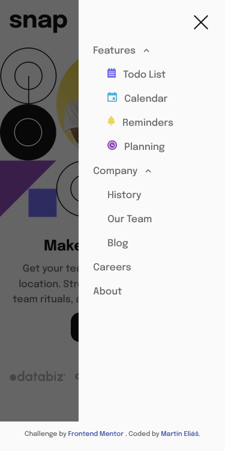

# Frontend Mentor - Intro section with dropdown navigation solution

This is a solution to the [Intro section with dropdown navigation challenge on Frontend Mentor](https://www.frontendmentor.io/challenges/intro-section-with-dropdown-navigation-ryaPetHE5). Frontend Mentor challenges help you improve your coding skills by building realistic projects.

## Table of contents

- [Overview](#overview)
  - [The challenge](#the-challenge)
  - [Screenshot](#screenshot)
  - [Links](#links)
- [My process](#my-process)
  - [Built with](#built-with)
  - [Useful resources](#useful-resources)
- [Author](#author)

## Overview

### The challenge

Users should be able to:

- View the relevant dropdown menus on desktop and mobile when interacting with the navigation links
- View the optimal layout for the content depending on their device's screen size
- See hover states for all interactive elements on the page

### Screenshot

### Links

- Solution URL: [https://www.frontendmentor.io/solutions/intro-section-with-dropdown-nav-SyNwWfbU5](https://www.frontendmentor.io/solutions/intro-section-with-dropdown-nav-SyNwWfbU5)
- Live Site URL: [https://intro-section-with-dropdown-navigation-main-lovat.vercel.app/](https://intro-section-with-dropdown-navigation-main-lovat.vercel.app/)

## My process

### Built with

- Semantic HTML5 markup
- CSS custom properties
- Flexbox
- Mobile-first workflow
- SCSS
- ES6

### Useful resources

- [Sass/SCSS](https://sass-lang.com/) - This CSS extension helped me to write CSS faster and with prefixes automatically.
- [Flexbox](https://css-tricks.com/snippets/css/a-guide-to-flexbox/) - This helped me to style my elements properly with flexbox.

## Author

- LinkedIn - [Martin Eliáš](https://www.linkedin.com/in/martin-eli%C3%A1%C5%A1-455550209/)
- Frontend Mentor - [@martinelias1312](https://www.frontendmentor.io/profile/martinelias1312)
